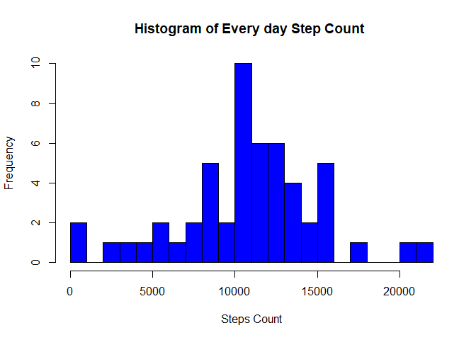
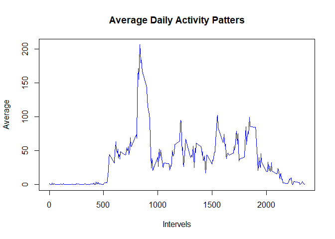
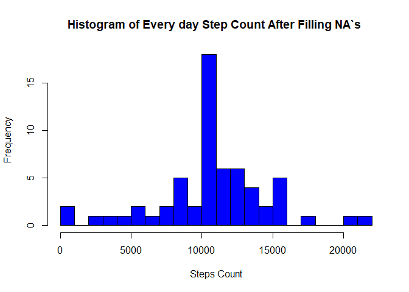
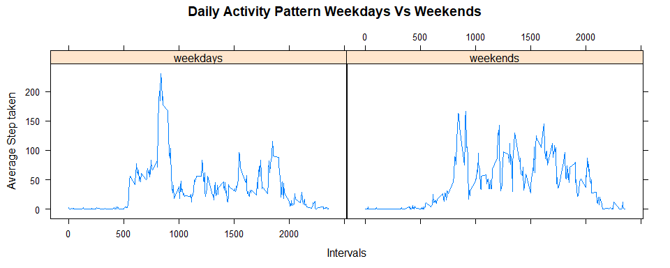

## Loading and preprocessing the data

```r
#Loading
data<-read.csv('activity.csv',header = T,colClasses = c('numeric','Date','character'))
```

## What is mean total number of steps taken per day?


```r
#install package dplyr using below command if not installed
#install.packages('dplyr')
library(dplyr)
```

```r
data<- group_by(data,date)
day_steps<-summarise(.data = data,count = sum(steps))
```
#### Histogram for No. of steps taken Each Day

```r
hist(day_steps$count,breaks = 30,plot = T,freq = T,xlab ="Steps Count",
                          main = "Histogram of Every day Step Count ",col= "blue" )
```

<!-- -->

```r
day_mean<-summarise(.data = data,means= mean(steps,na.rm = TRUE))
day_median<- summarise(.data = data,median = median(steps,na.rm = TRUE))
```

```r
#Mean steps per day
day_mean
```

```
## # A tibble: 61 x 2
##    date         means
##    <date>       <dbl>
##  1 2012-10-01 NaN    
##  2 2012-10-02   0.438
##  3 2012-10-03  39.4  
##  4 2012-10-04  42.1  
##  5 2012-10-05  46.2  
##  6 2012-10-06  53.5  
##  7 2012-10-07  38.2  
##  8 2012-10-08 NaN    
##  9 2012-10-09  44.5  
## 10 2012-10-10  34.4  
## # ... with 51 more rows
```

```r
#median steps per day
day_median
```

```
## # A tibble: 61 x 2
##    date       median
##    <date>      <dbl>
##  1 2012-10-01     NA
##  2 2012-10-02      0
##  3 2012-10-03      0
##  4 2012-10-04      0
##  5 2012-10-05      0
##  6 2012-10-06      0
##  7 2012-10-07      0
##  8 2012-10-08     NA
##  9 2012-10-09      0
## 10 2012-10-10      0
## # ... with 51 more rows
```

## What is the average daily activity pattern?

```r
data$interval<- as.numeric(data$interval)
data = group_by(data,interval)
int_mean = summarise(.data = data ,means = mean(steps,na.rm = TRUE))
plot(int_mean$interval,int_mean$means,type= "l" ,xlab = 'Intervels',ylab = 'Average',main = 'Average Daily Activity Patters',col = 'blue')
```

<!-- -->
#### Maximum number of steps


```r
max_steps=int_mean[int_mean$means==max(int_mean$means),1]
print(max_steps)
```

```
## # A tibble: 1 x 1
##   interval
##      <dbl>
## 1      835
```

## Imputing missing values
#### No of NA in Dataset

```r
no_fo_NA = (which(is.na(data$steps)))
length(no_fo_NA)
```

```
## [1] 2304
```
#### Imputing NA`s with mean of that interval with Rounded values

```r
merge_data  = merge(data,int_mean)
# filling missing values
merge_data$steps[which(is.na(merge_data$steps))] = round(merge_data$means[which(is.na(merge_data$steps))])
# creating New dataset
new_dataset = merge_data[,c(2,3,1)]
new_dataset = arrange(.data = new_dataset,date)
```


```r
new_dataset<- group_by(new_dataset,date)
new_day_steps<-summarise(.data = new_dataset,count = sum(steps))
hist(new_day_steps$count,breaks = 30,plot = T,freq = T,xlab ="Steps Count",
                          main = "Histogram of Every day Step Count After Filling NA`s ",col= "blue" )
```

<!-- -->

```r
new_day_mean<-summarise(.data = new_dataset,means= mean(steps,na.rm = TRUE))
new_day_median<- summarise(.data = new_dataset,median = median(steps,na.rm = TRUE))
new_day_mean
```

```
## # A tibble: 61 x 2
##    date        means
##    <date>      <dbl>
##  1 2012-10-01 37.4  
##  2 2012-10-02  0.438
##  3 2012-10-03 39.4  
##  4 2012-10-04 42.1  
##  5 2012-10-05 46.2  
##  6 2012-10-06 53.5  
##  7 2012-10-07 38.2  
##  8 2012-10-08 37.4  
##  9 2012-10-09 44.5  
## 10 2012-10-10 34.4  
## # ... with 51 more rows
```

```r
new_day_median
```

```
## # A tibble: 61 x 2
##    date       median
##    <date>      <dbl>
##  1 2012-10-01   34.5
##  2 2012-10-02    0  
##  3 2012-10-03    0  
##  4 2012-10-04    0  
##  5 2012-10-05    0  
##  6 2012-10-06    0  
##  7 2012-10-07    0  
##  8 2012-10-08   34.5
##  9 2012-10-09    0  
## 10 2012-10-10    0  
## # ... with 51 more rows
```
New Values of mean and median are different from the previous values, because as missing values are replaced by means of that interval the sum of that interval got increased. this will effect mean and some values of median.

And the no. of steps each day incresed and histogram is more symmetric to center. 

## Are there differences in activity patterns between weekdays and weekends?


```r
# Adding new factor variable to dataset
new_dataset$weekday = weekdays(x = new_dataset$date,abbreviate = T)
new_dataset[new_dataset$weekday %in% c("Sun","Sat"),]$weekday ='weekends' 
new_dataset[new_dataset$weekday %in% c("Mon","Tue","Wed","Thu","Fri"),]$weekday ='weekdays' 
new_dataset$weekday<- as.factor(new_dataset$weekday)
```


```r
# Adding package "ggplot2" to make plots
library(lattice)
new_dataset<- group_by(new_dataset,interval,weekday)
averages<- summarise(new_dataset,mean = mean(steps))
xyplot(mean~interval|weekday,data = averages,type = 'l',xlab ='Intervals',ylab = 'Average Step taken'
        ,main = 'Daily Activity Pattern Weekdays Vs Weekends')
```

<!-- -->
As we see different patterns on **Weekdays** and **weekends** and people are more likely to walk more Weekdays.
For less movement on weekdays the office can be a reason,because when people reached to office do there work and have less time to walk But on weekends office are closed so people have good time to walk or play or mobile works.
